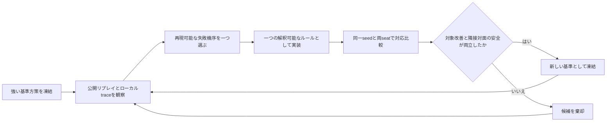
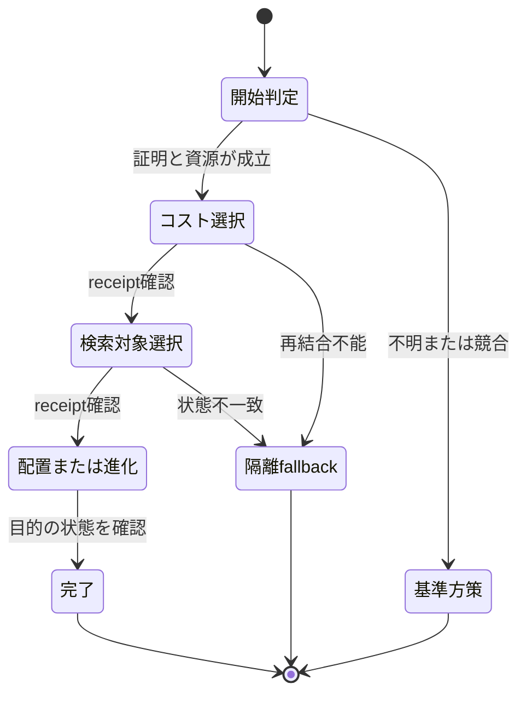
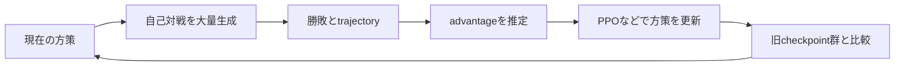

# ポケカAIコンペティション技術ガイド

## 読み始める前の三つの区分

ポケカAIは、強いカードを一枚選ぶだけのプログラムではない。

山札と手札に不確実性があり、同じカードでも使う順番によって次の選択肢が変わり、目の前の攻撃と数ターン後の勝ち筋が衝突する。

この難しさに対し、このプロジェクトは最終的に**決定論的ルールベース**を採用した。

ただし、研究段階では探索、強化学習、模倣学習も実装して検証している。

さらに、Kaggleの公開情報には、他の参加者が自己対戦型の強化学習やRLと探索の組み合わせを使ったという報告がある。

三者を混ぜると、実戦投入した技術と、試して棄却した技術と、他者の公開手法の境界が消えてしまう。

そこで、各手法を次の印で区別する。

- **採用**：正式な提出候補または正式な方策に組み込んだ。
- **研究**：実装して測定したが、最終方策には採用しなかった。
- **外部**：他の参加者または公開教材で確認したが、このプロジェクトの正式方策には使わなかった。

対象範囲は、提出エージェント、デッキ選定、メタ調査、リプレイ解析、ローカル評価、学習実験、再現性、パッケージ、Kaggle運用、開発支援の役割分離である。

人間対戦GUIは競技方策ではないが、局面確認とリプレイ再生を支える周辺技術として短く扱う。

> 2026年8月24日時点では、コンペティションの最終評価期間が続いている。
> 公開リプレイの思考時間から上位エージェントの方式を推定した投稿はあるが、最終上位者全員の内部実装が公開されたわけではない。
> 「上位陣の手法」は、本人が公開した内容と、公開上そう推定された内容を分けて読む必要がある。

## 1. 一枚の合法手を返すプログラム

Kaggleのエージェントは、局面を受け取り、提示された合法手の番号を返す関数である。

ゲーム開始時だけは60枚のデッキを返し、その後は`obs.select.option`の中から選択する。

提出物は`submission.tar.gz`であり、直下に`main.py`と`deck.csv`を置き、実用上は公式の`cg/`ランタイムも同梱する。

```python
def agent(observation):
    if observation["select"] is None:
        return sixty_card_deck

    legal_options = observation["select"]["option"]
    return choose_legal_indices(observation, legal_options)
```

見た目は単純だが、選択は一回で終わらない。

たとえばハイパーボールを使うと、「カードを使う」「コストを2枚捨てる」「山札から1枚選ぶ」という複数のコールバックが続く。

最初の一手だけ正しくても、途中で別の目的へ切り替われば取引全体が壊れる。

このプロジェクトでは、一連の選択を**トランザクション**として扱った。

### 観測できるものと観測できないもの

自分の手札、公開された場、トラッシュ、残りサイド枚数、合法手は観測できる。

相手の手札の内容、山札の順番、伏せたサイドの内容は観測できない。

この状態を**部分観測**という。

部分観測ゲームでは、実際の隠し状態を知って学習した教師が強く見えても、提出エージェントが同じ判断を再現できるとは限らない。

したがって、状態表現、探索、学習データのすべてで「その情報を実戦時に観測できるか」を検査した。

### 生の番号ではなく意味で行動を扱う

合法手の配列順は、同じ意味の局面でも変わり得る。

そこで、`option[3]`のような生の添字を学習や保存の恒久IDにせず、次の情報から**意味的行動**を作った。

- 行動種別：カード使用、エネルギー付与、進化、特性、攻撃、逃げる、終了など。
- 対象：バトル場、ベンチ位置、カードID、所有者。
- 物理個体：同名カードを区別できる場合のserial。
- 選択文脈：セットアップ、捨てるカード選択、山札検索、攻撃選択など。
- 複数選択：枚数制約と、順序を含む完全な選択列。

意味的行動を現在の合法手へ結び直す処理を**セマンティックバインディング**という。

保存した意味と現在の合法手が一意に対応しない場合は、推測せず基準方策へ戻した。

## 2. ポケカの勝ち筋を状態機械へ変える

ルールベースは「カードAならカードBを使う」という条件分岐の集合ではない。

デッキが勝つまでの役割と順序を、局面から局面へ遷移する状態機械へ変換したものだ。

このプロジェクトで共通して追跡した対象は次のとおりである。

- **セットアップ**：事故を避け、初期のバトル場とベンチを決める。
- **盤面形成**：主攻撃役、控え攻撃役、ドロー役、壁役をそろえる。
- **資源投入**：エネルギー、進化札、検索札、サポート権を割り当てる。
- **攻撃開始**：準備を続けるより攻撃へ移るべき時点を決める。
- **攻撃継続**：主攻撃役が倒された後も、次の攻撃を止めない。
- **サイド交換**：何体を倒し、何枚のサイドを取って勝つかを決める。
- **妨害と復旧**：相手の計画を遅らせながら、自分の勝ち筋を戻す。
- **終盤変換**：ボスの指令などで、盤面優位を最終サイドへ変える。

### シークエンシング

同じカードを使っても、順番が違えば得られる情報と残る資源が変わる。

一般ドローを先に使えば、その後の山札検索で本当に不足したカードだけを取れる。

反対に、山札を薄くしてから特定カードを引きたい局面では、検索や捨てる処理を先に行う価値がある。

この「何をするか」だけでなく「どの順番でするか」を決める考え方が**シークエンシング**である。

### サイドマッピング

勝利までに必要な6枚のサイドを、どの相手から何ターンで取るかを決める。

2サイドのポケモンを3体倒すなら`2-2-2`、1サイドを挟むなら`1-2-2-1`のように表せる。

目の前で倒せる相手が、最短の勝ち筋とは限らない。

ボスの指令で2サイド対象を呼べば勝てる局面では、現在の1サイドKOより高い優先度を与える。

### 攻撃継続

一度の大きな攻撃より、毎ターン攻撃できる方が強いことが多い。

そこで、現在の攻撃役だけでなく、次の攻撃役までに必要な進化、手張り、入れ替え、検索の不足数を測った。

この不足数を**次アタッカー距離**として扱うと、ベンチの未完成ポケモンにも将来価値を与えられる。

## 3. 採用した改善ループ

最も成果が安定したのは、強い基準方策を保存し、一つの失敗機序だけを直し、同一条件で比較する反復だった。



このループには、次の制約を置いた。

1. 基準方策のソースとデッキをハッシュで固定する。
2. 一度に変更するルールテーマは一つだけにする。
3. 変更対象の対面だけでなく、隣接する主要対面も測る。
4. 同じseedを基準と候補へ与え、両方のseatを評価する。
5. 勝率だけでなく、初動、控え準備、資源、攻撃間隔、サイド交換を確認する。
6. すべての勝敗差について、最初に行動が分かれた局面を調べる。
7. 明確に有害な機序が一つでもあれば、平均が正でも棄却する。

ガルーラとイワパレスを相手にした山札切れ対策は、この手順が機能した代表例である。

旧方策は特定のデッキ名だけを見て検索を止めたため、別構成のイワパレス相手にポケパッド、ポケギア、探検家の先導、ハイパーボールを使い続けた。

修正は相手名への例外ではなく、公開されたイワパレス、自分の残り山札、完成済み攻撃役を条件に、不要な検索を止める資源規則だった。

対象対面は`46/64`から`59/64`へ改善し、主要smoke全体も`0.7396`から`0.7656`へ上がった。

個別の負けを暗記するのではなく、同じ原因で起こる将来の負けも止めたことが、この修正の価値である。

## 4. メタゲーム調査とデッキ選定

強い方策を作っても、想定した相手が存在しなければ順位には結び付かない。

そこで、KaggleのDaily Top Episodes、Leaderboardスナップショット、公開デッキを使って**メタゲーム**を調査した。

### デッキを完全な60枚で数える

アーキタイプ名だけでは、同じ名前の中に異なる構築が混ざる。

全カードIDを並べた60枚リストからハッシュを作り、完全一致デッキとアーキタイプを別の粒度で保存した。

同じチームが同じ日に何十試合も現れると、対戦席をそのまま数えた比率は一人の活動量に引っ張られる。

そのため、次の三つの集約を併記した。

- **対戦席**：公開された全seatを数える。
- **チーム日**：同じチームの同じ日の連戦を一票へ抑える。
- **各チーム最新**：観測範囲内の最後のデッキを一票とする。

実際、マーニーとオーロンゲは対戦席では55.4%だったが、チーム日では39.6%だった。

「公開試合の過半数」と「参加者の過半数」は同じではない。

### 選択バイアスと感度分析

Daily Top Episodesは高スコア試合を意図的に集めた標本であり、全参加者からの無作為抽出ではない。

同じチームの反復もあるため、通常の独立二項試験をそのまま当てはめなかった。

代わりに、平均スコア順と対戦者の低い側のスコア順を比較し、チームを一つずつ除くleave-one-team-outと、未観測対面を0%、25%、50%と仮定するシナリオ分析を行った。

フーディン対マーニーは、rawでは46.77%、チーム対日単位の等加重では59.69%となり、集約方法で優劣が反転した。

この結果は「フーディンが有利」と断定する材料ではなく、小さな実装で先に確かめるべき不確実性を示している。

### 勝者と敗者の差は因果ではない

公開リプレイでは、勝者側が早く進化した、早く攻撃した、控えを準備していた、といった差を測れる。

しかし、強い手札を引いたから早く進化でき、そのまま勝った可能性もある。

観測差は仮説を作る材料であり、行動ラベルではない。

このプロジェクトでは、勝敗相関をそのまま模倣せず、ルール仮説に変換して対応付き対戦で検証した。

## 5. ルールエージェントの内部構造

大きな`if`文を上から並べると、後から追加した規則が以前の安全規則を横取りする。

採用した設計は、観測を正規化し、複数のルールが提案を作り、一つのresolverが優先順位と証明を検査して最終行動を決める構造である。

### 5.1 公開状態の正規化

エンジンが渡す辞書と、ローカルツールが作るデータクラスを、同じ**公開状態ビュー**へ変換した。

状態ビューには、自分と相手のバトル場、ベンチ、手札枚数、公開カード、エネルギー、サイド枚数、ターン情報、合法手を入れる。

非公開情報は入れない。

状態と合法手にはフィンガープリントを付け、証明を作った局面と実際に実行する局面が同じかを検査した。

### 5.2 特徴量

ルールが直接扱いやすい形へ、公開状態から特徴を計算した。

代表例は次のとおりである。

- 現在攻撃できるか。
- 一手張り後に攻撃できるか。
- 対象を確定KOできるか。
- 相手から確定KOされるか。
- 取れるサイド枚数はいくつか。
- 次の攻撃役に何枚のエネルギーが足りないか。
- 相手がポケモンexからのダメージを防ぐか。
- 相手が1サイド主体か。
- 弱点を突ける高サイド対象がいるか。
- ベンチダメージの脅威が公開されているか。

### 5.3 有限の経路列挙

任意の未来を探索する代わりに、デッキで意味のある少数の**経路**を列挙した。

例として、ハイパーボールで進化先を取り、コストを払い、対象を進化させる経路や、ボスの指令で相手を呼び、対象を確定し、攻撃する経路がある。

有限経路は、必要資源、途中の選択、終了条件をすべて事前に検査できる。

### 5.4 単一resolver

各ルールは最終行動を直接返さず、次のような提案を返す。

```text
提案 = {
  rule_id,
  action,
  category,
  purpose,
  exact_proof,
  transaction
}
```

resolverは、実行中トランザクション、今すぐ勝利、確定サイド、同じ攻撃を保つ改善、資源改善、安全fallbackの順に提案を比較する。

同じ優先度で優劣を証明できなければ、基準方策へ戻る。

### 5.5 証明書

ルールが「この攻撃で勝つ」「このボスで多くサイドを取る」と主張するには、局面に結び付いた**証明書**が必要になる。

証明書は、攻撃ID、攻撃役、対象、必要エネルギー、ダメージ、弱点、抵抗力、ダメージ防止、取れるサイド、合法手集合、状態ハッシュを含む。

対象ダメージだけが分かっていても、反動、自分のエネルギー破棄、攻撃不能、特殊状態が未確認なら、勝利証明には昇格させない。

### 5.6 fail-closed

不明な効果を「効果なし」と仮定すると、エージェントは自信を持って誤る。

この設計では、不明、曖昧、同率、証明不足、owner競合を**UNKNOWN**として扱い、既存の強い基準方策へ戻す。

これを**fail-closed**という。

強い新規行動を増やすより、証明できない局面で壊さないことを優先した設計である。

### 5.7 Resource Ledger

同じエネルギーや同じ捨て札候補を、二つの将来計画が同時に使うことはできない。

そこで、カードIDだけでなく所有者とserialを含む物理参照を予約する**Resource Ledger**を使った。

予約には、現在の経路、次アタッカー、対面上の最低資源、役割カード一枚などの強さを持たせた。

ハイパーボールのコスト選択は、現在の攻撃用エネルギーや唯一の控え系統を予約済みなら捨てない。

### 5.8 トランザクション所有権

複数コールバックにまたがる処理は、一つのownerだけが所有する。



各段階で、直前に選んだ物理カード、公開ログ、手札とトラッシュの変化、合法手の意味を照合する。

同じpromptが再送された場合は、配列の順番ではなく意味で同じ行動へ結び直す。

開始後に計画を完了できないと判断した場合、別ルールへ勝手に乗り換えず、fault containmentへ入る。

## 6. デッキ別の実装例

### 6.1 ジュラルドンとArchaludon ex

正式な強さの基準には、過去にSilver帯へ到達した完全実行可能なArchaludon方策を使った。

基本計画は、ジュラルドンを置き、Archaludon exへ進化し、メタルメーカー系の加速と手張りで攻撃を始め、控えを作りながらサイドを取り切る流れである。

正式なsingle-resolver成果物では、次の安全な規則が残った。

- 初期配置でジュラルドンが一体だけのときの安全なセットアップ。
- 親方策がドローへ進む前に、攻撃を保ったまま確定できる盤面形成。
- 今すぐの勝利と、より多いサイドを取る一意なボス経路。

最終760局では基準`478/760`、候補`480/760`、対応付きのgain、regression、tieが`4/2/754`だった。

基礎的な非破壊ゲートは通ったが、強化を主張する閾値`486/760`には届かなかった。

したがって、評価は「壊さず再基準化できる」であり、「統計的に強くなった」ではない。

その後のRule 3修復は、開始したハイパーボール経路を10件すべて完了し、固定760局で親と完全同率になった。

この修復も強化証拠ではなく、複数段階処理を安全に完了できることの証拠である。

### 6.2 フーディンとノココッチ

フーディンは手札枚数を打点へ変えるため、「カードを使うほど打点が下がる」という独特の機会費用を持つ。

ケーシィ系統を複数作り、ノココッチのにげあしドローとエンリッチエネルギーで手札を増やし、ハンドパワーへ変換する。

ここでは、盤面を広げ続けることより、展開から攻撃へ切り替える時点が難しい。

方策は、確定KOを壊す任意行動を避け、次の攻撃役までの距離を測り、ノココッチをドロー役として使う価値と壁として残す価値を分けて考えた。

新しい60枚へ旧方策を移植した段階では、削除されたカードの規則が発火しないことと、共有51枠だけで成立する121状態の行動一致を確認した。

次に、新規9枠のカードを専用トランザクションで扱い、比較では`428/700`から`451/700`へ増えた。

一方、攻撃継続を狙った後続版は700局すべてで行動が同一だった。

安全に何もしなかったことは確認できても、攻撃継続を改善したとは言えないため棄却した。

現行READMEが示す正式経路は、後続の壁行動案を採用せず、C2 action pathを維持している。

### 6.3 メガルカリオex

メガルカリオ実装では、公開状態ビュー、特徴量、有限経路、Resource Ledger、証明書、トランザクション、単一resolverを別モジュールへ分離した。

主な判断は、初期配置、ポケパッド、ファイティングゴング、ハイパーボール、手張り、進化、Aura Jab、Mega Brave、Wild Press、ボス、入れ替え、ヒーローマントである。

攻撃ダメージの計算と、攻撃後の完全な結果を別に扱った。

これは、ダメージが足りていても、攻撃不能効果や反動、サイド交換まで含めると最良手ではない場合があるためである。

446件のテストと静的検査を通し、初動停止を起こした検索保証と手張りresolver配線を修正した。

ただし、修正後の広い両席比較は実施していないため、これは実装完全性の証拠であり、Leaderboard上の強さの証明ではない。

## 7. リプレイ分析

リプレイは、正解行動の教師ではなく、失敗機序を発見する観察記録として使った。

### 7.1 loss bucket

負けを相手アーキタイプ、seat、終局理由、盤面形、残りサイド、残り山札でまとめたものを**loss bucket**という。

一試合だけの奇妙な負けを直すより、同じ失敗が繰り返されるbucketを先に調べる。

代表的な分類は、初動停止、控え不在、攻撃間断、山札切れ、不要な2サイド献上、ボス対象誤り、確定KO見逃しである。

### 7.2 first divergence

基準方策と候補方策を同じseedで動かし、最初に行動が分かれたコールバックを探す。

勝敗差だけを見ると、数十手前の小さな変更が最後の勝敗へどうつながったか分からない。

first divergenceから盤面を追えば、意図したルールが発火したか、別の規則を壊したか、差が偶然の乱数へ流れただけかを判断できる。

### 7.3 シャドー実行

候補ルールに実際の行動を変えさせず、「もし提案するなら何を提案したか」だけを記録する方式を**シャドー実行**という。

シャドーで発火回数、証明不足、owner競合、対象の一意性を測ってから、実行経路へ入れる。

0回発火のルールは安全に見えるが、強さの証拠はない。

到達していないコードが本番で初めて発火する危険も残るため、自然到達fixtureが必要になる。

### 7.4 公開Goldリプレイの扱い

上位リプレイには強い判断が含まれるが、相手、手札、山札順、方策の癖が違う。

そこで、Gold行動を絶対的な正解にせず、候補行動を提案する専門家として扱った。

公開状態から再現できる意味的行動へ変換し、複数の隠し状態と複数の相手方策でrolloutし、基準行動との差を測った。

この厳しい手順でも、局面数が少ないとrankerは訓練状態を暗記する。

実際、3訓練状態ではtrain top-1が100%でも、development top-1は0%から20%にとどまった。

## 8. ローカル評価と統計

勝率だけを一つ表示すると、seat差、相手別の壊れ方、乱数差が隠れる。

このプロジェクトは、評価を「同じ試合条件における基準と候補の差」として設計した。

### 8.1 同一seedと両seat

各相手に対し、基準と候補へ同じエンジンseedを与える。

同じ方策をplayer 0とplayer 1の両方へ置き、先後やseat依存を分ける。

評価キーは概念的に次の組である。

```text
(panel, opponent, seat, seed)
```

このキーが基準と候補で完全一致しなければ、対応比較として扱わない。

### 8.2 対応差

各キーについて、候補だけが勝てば`+1`、基準だけが勝てば`-1`、同じ結果なら`0`とする。

```text
d_i = candidate_win_i - baseline_win_i
```

平均差は`mean(d_i)`である。

同じ乱数条件を共有するため、別々の勝率を単純に引くより、方策変更そのものの影響を捉えやすい。

### 8.3 gain、regression、tie

- **gain**：基準は負け、候補は勝ち。
- **regression**：基準は勝ち、候補は負け。
- **tie**：両方とも勝ち、または両方とも負け。

`4/2/754`なら、760組のうち勝敗が変わったのは6組だけである。

候補の総勝利が2増えても、754組は同じであり、効果が小さいことが分かる。

### 8.4 McNemar検定と区間

対応付き二値結果では、勝敗が食い違った組だけを使うMcNemarの正確検定を使える。

最終Archaludon比較ではgain 4、regression 2で、両側`p=0.6875`だった。

対応差の95%区間も0を含んだため、「候補が強い」とは断定しなかった。

統計的有意差がないことは「完全に同じ」の証明ではない。

この場合は、観測差が小さく、強化を主張する証拠が足りないという意味になる。

### 8.5 opponent floor

全体平均が高くても、特定対面で35%しか勝てないなら、その弱点は残る。

そこで、全体、seat、相手、相手とseatのセルごとに最低成績と基準からの後退幅を確認した。

最終Archaludon候補は全体63.16%だったが、ガルーラとイワパレスには31/80だった。

平均だけを採用条件にしなかった理由がここにある。

### 8.6 重複対照

同じ方策を同じseedで二回実行し、勝敗、手数、ターン、エラー、traceが一致するか確認した。

これを**duplicate control**という。

一致しなければ、方策差より先にエンジン乱数、グローバル状態、実行環境を疑う。

stockのローカルBattle APIがPythonのseedだけでは固定されない問題も見つかり、seed対応エンジンを評価に使った。

## 9. 再現性と提出物の工学

競技AIでは、学習や方策の内容と同じくらい「何を実行したか」を固定する必要がある。

### ハッシュとmanifest

基準、候補、デッキ、エンジン、相手、runner、評価仕様をSHA-256で固定した。

実行後は、コマンド、終了コード、行数、seed、出力ファイル、ファイルサイズ、ハッシュをmanifestへ保存した。

候補名が同じでも、1バイト違えば別の方策である。

### 原子的な出力

対戦途中のJSONLを完了済みデータと誤認しないように、各episodeを一時出力から確定し、全episode完了後に最終manifestをcommit markerとして置いた。

途中再開では、既存のtask IDとハッシュを検査し、完了済みshardを再実行しない。

### エラーを勝敗へ混ぜない

開始失敗、invalid action、例外、timeout、max-step到達を負けとして黙って集計すると、戦略の弱さと実装障害が混ざる。

これらは独立した列で0件を要求した。

### WindowsとLinuxの差

同じ論理キーを持つrolloutでも、WindowsとKaggle Linuxで終局utilityが一致しない例があった。

ある監査では1,152行中277行、24.05%が不一致だった。

異なるプラットフォームのshardを一つの教師データへ混ぜず、Kaggle用教師ではLinuxを権威側とした。

### 開発支援エージェントの役割分離

提出エージェントの外側では、調査、実装、実行、数値監査、戦略判断を別の作業役へ分けた。

ログ収集役と評価実行役は、コマンド、終了コード、行数、ハッシュ、raw出力だけを返し、勝率の意味を判断しない。

数値監査役はraw行から勝敗、対応差、区間、bucket floorを再計算し、戦略判断役はその数値とリプレイを結び付けて採否を判断する。

ルール実装は一度に一人のwriterだけが担当し、同じソースへ複数の変更を同時に入れなかった。

Kaggleへの提出、置換、公開などの外部書き込みはrootだけが所有した。

この役割分離により、実行担当の「完了した」という報告を、そのまま強さの証拠として採用することを防いだ。

言語モデルは開発と分析を支援したが、提出runtimeが対戦中に外部モデルへ問い合わせる構成ではない。

正式方策は、提出archive内だけで動く決定論的なPythonコードである。

### ローカル人間クライアントとリプレイ

周辺成果物として、PySide6とQt Quick/QMLによるWindows向け人間対戦クライアントも設計した。

GUI親プロセスは完全情報やnative engineを直接保持せず、一試合ごとのspawn子プロセスだけがエンジンとagentを読み込む。

画面へ渡す状態は、非公開情報を除いた`HumanViewState`と合法手要求へ限定した。

対戦後は完全局面を含むリプレイを封印し、ライブ中の情報漏えいと試合後分析を分けた。

agentとデッキはSHA-256で識別し、登録後の改変を検出する。

このクライアントは方策を強くする学習器ではないが、人間が盤面、選択、ログ、リプレイを確認できる診断基盤である。

### パッケージ検証

提出前には、archive直下の`main.py`、`deck.csv`、`cg/`、60枚制約、ACE SPEC枚数、import、最終callable、パス依存、不要ファイルを検査した。

学習コードが動いても、提出runtimeが別の設定、別の上限、別の行動文脈を使えば別方策である。

設定値も方策の一部としてハッシュへ含めた。

## 10. 研究したが最終採用しなかった学習手法

学習手法は未使用だったのではない。

実装し、評価し、強い基準を超えなかったため、正式方策から外した。

### 10.1 線形Residual Policy

完全なルール方策を捨てず、上位の合法候補だけへ小さな学習補正を足す。

```text
final_score(a) = rule_score(a)
               + clip(scale × weight × feature(a), -cap, cap)
```

ゼロ重みなら基準行動を完全再現し、特徴抽出や推論に失敗したら基準へ戻る。

利点は、安全規則を残したまま局所的な順序だけを学べることにある。

しかし、訓練対面での小さな改善が別のArchaludon方策やlarger holdoutで反転した。

最終的に線形residualは採用しなかった。

### 10.2 REINFORCE

REINFORCEは、対戦結果で選んだ行動の確率を上下させる方策勾配法である。

```text
更新方向 ∝ (最終報酬 - baseline) × ∇ log π(a|s)
```

勝った試合で選んだ行動の確率を上げ、負けた試合では下げる。

移動平均baselineを引くと、単なる勝敗の揺れによる分散を減らせる。

このプロジェクトでは終局の勝敗に、小さく制限したサイド差を加え、相手ごとのbaseline、両seat、温度付きsamplingを使った。

長い試合のすべての行動へ同じ終局報酬を配るため、どの一手が勝敗へ効いたかというcredit assignmentが粗い。

### 10.3 Cross-Entropy Method

Cross-Entropy Methodは、勾配を使わない分布探索であり、ここでは**CEM**と略す。

1. 重みの平均と分散から複数候補をサンプルする。
2. 各候補を同じ対戦scheduleで評価する。
3. 上位eliteだけを残す。
4. eliteの平均と分散で次世代の分布を更新する。

実装では、平均改善だけでなく最悪相手bucketへの罰則を加えたrobust gainで候補を並べた。

低次元の重み探索には使いやすいが、試合数が少ないと乱数の上振れをeliteとして選び続ける。

状態やターンで次元を増やしても、外部holdoutで安定しなかった。

### 10.4 Policy-Value Network

状態から勝つ見込み`V(s)`を出すvalue headと、合法手の好み`π(a|s)`を出すpolicy headを一つのネットワークで学習した。

方策headは基準ルールの行動を模倣し、value headは終局勝敗を教師にする。

この構成は、模倣で最低限の合法行動を覚え、valueで長期結果を測る土台になる。

しかし、基準方策の模倣だけでは基準を超えず、終局報酬だけのvalueは似た局面を十分に区別できなかった。

### 10.5 Residual PPO

PPOは、収集時の方策から一度に離れすぎないように更新幅を制限するactor-critic法である。

このプロジェクトでは、ルール方策が自由判断をした単一選択のMAIN局面だけを学習可能にした。

保護ルール、retry、rollback、例外、複数選択、トランザクション中は学習方策が介入しない。

参照分布`q_latest`とニューラル残差`r(a)`は次の形で合成した。

```text
p(a) ∝ q_latest(a) × exp(2 × tanh(clamp(r(a), -3, 3)))
```

状態104次元、行動102次元の表現を使い、学習時はsampling、配置時は決定的argmaxとした。

GAE、clipped PPO、anchor KL、更新後のKL hard stopとrollback、50ms推論上限、NaN時fallbackを実装した。

それでも4、12、24 epochの比較はすべて`261/320`で、実効行動が変わらなかった。

モデルが更新されたことと、ゲーム中の行動が改善されたことは別である。

### 10.6 PCGrad

対面ごとの勾配が反対方向を向くと、ある相手への改善が別の相手を悪化させる。

PCGradは、衝突する勾配成分を互いに射影して取り除く方法である。

局所的な勾配衝突は減らせるが、状態表現が不足し、同じ特徴が異なる戦略状況を表している問題までは解決しない。

この系列も正式方策へは昇格しなかった。

### 10.7 Behavior Cloning

Behavior Cloningは、記録された状態と行動の組を教師あり学習する方法であり、**BC**と略す。

```text
loss = -log π(teacher_action | state)
```

このプロジェクトでは、生のoption indexを避け、公開状態と意味的行動だけを使うleakage-safe rankerを作った。

単一選択だけでなく、コスト選択から検索対象までをまとめたcomplete-action BCも試した。

complete-action BCは`229`から`248/320`で、基準`261/320`を下回った。

上位リプレイの行動は、その上位方策の隠れた前提、デッキ、相手、将来の引きに依存するため、観測だけから安定して再現できなかった。

### 10.8 DAgger

BCは、学習方策が一度教師と違う行動をすると、教師データにない局面へ入って誤りが連鎖する。

DAggerは、現在の学習方策が実際に訪れた局面へ教師ラベルを追加し、再学習する。

```text
教師データで学習
    → 学習方策で対戦
    → 訪れた局面へ教師行動を追加
    → 再学習
```

round 1後も`745/960`で、基準相当の81.5625%へ届かなかった。

教師自体が部分観測下で安定しない場合、データを追加するだけでは解決しない。

### 10.9 Rollout-QとSearch-Q

ある局面の各候補行動を一度実行し、その後を基準方策で最後まで対戦して得た報酬を`Q(s,a)`の教師にする。

この方法を**rollout-Q**という。

さらに、複数の隠し状態をサンプルし、同じ候補を各世界で試して平均する**multi-determinization Search-Q**も作った。

```text
Q_public(s, a) ≈ 平均_h Q(complete_state_h, a)
```

ここで`h`は、公開情報と矛盾しない相手手札、山札、サイドの仮説である。

native Search APIの状態はprocess-globalであるため、別branchの`search_begin`、`search_step`、`search_end`を同じprocessで無秩序に並行実行しなかった。

branch workerを独立processへ分け、固定shardとtask IDで再開可能にした。

Round 0では98,323件のbranch結果を完走したが、これらの学習方策は正式Archaludonへimportしていない。

探索が一つの仮想隠し状態へ過適合しないための基盤にはなったが、強い提出方策としての昇格証拠は別に必要だった。

### 10.10 Gold rollout teacher

上位リプレイの局面で、記録行動と候補行動を複数の相手方策、batch、particleでrolloutし、advantage、下側信頼限界、最悪opponent headを保存した。

この教師は「上位者が選んだ行動」を直接ラベルにせず、「同じ公開局面で複数の仮想世界を試した結果」をラベルにする。

教師行動を見てから候補集合へ追加すると、候補生成の時点で正解が漏れる。

候補集合は公開状態、既存ルール、事前固定した完全行動bridgeから作り、教師結果を見る前に固定した。

それでも候補の順位はparticle数、相手方策、WindowsとLinuxで変わり、広いrankerへ一般化しなかった。

結果として、Goldリプレイは局面診断とルール仮説の材料に戻した。

## 11. 上位帯で報告された強化学習系の手法

公開情報から確実に言える範囲は限定される。

ある時点で2位だった参加者は、ルールや探索に見える上位エージェントの多くが、実際にはRLまたはRLと探索の組み合わせだとコメントした。

一方、思考時間から方式を分類した投稿者自身は、分類が推定であると明記している。

別の参加者は純粋自己対戦でSilverへ到達したと報告し、効率的な盤面表現と小さめのpolicyを挙げた。

したがって、ここで解説するのは「最終上位者全員がこの実装だった」という確定情報ではなく、上位帯で本人報告または強い示唆があった技術系列である。

### 11.1 純粋自己対戦

人間の正解行動を与えず、同じ学習方策同士を大量に戦わせる。

勝った側の行動を増やし、負けた側の行動を減らすことで、ゲーム知識を経験から獲得する。



純粋自己対戦の弱点は、二者が同じ癖を学ぶと、その癖を互いに罰しないことである。

過去checkpoint、強い公開エージェント、異なるデッキを相手poolへ入れると、戦略の循環と過適合を減らせる。

### 11.2 PPOとcheckpoint opponent pool

PPOは、古い方策で集めたtrajectoryから、新しい方策を少しずつ更新する。

確率比を`r_t = π_new(a_t|s_t) / π_old(a_t|s_t)`とすると、代表的な目的は次の形になる。

```text
L = 平均 min(
      r_t A_t,
      clip(r_t, 1-ε, 1+ε) A_t
    )
```

`A_t`は、その行動が平均よりどれだけ良かったかを表すadvantageである。

clipにより、一回の更新で方策が急変するのを抑える。

公開報告には、直前のbest checkpointと強い公開エージェントを交互に相手にしたcheckpoint-based PPOで自己最高スコアを得たという例がある。

この相手poolは、最新方策だけを倒す狭い戦略への偏りを防ぐ。

### 11.3 Actor-CriticとGAE

**actor**は行動確率を出し、**critic**は局面価値を予測する。

終局まで待たずに「予想より良かった一手」を推定できるため、長いゲームのcredit assignmentを改善する。

GAEは、短期のTD誤差と長期の実報酬を係数`λ`で混ぜ、biasとvarianceを調整する。

`λ`が小さいほどcriticを信頼し、`λ`が大きいほど実際の長期報酬を重く見る。

価値表現が弱いと、似て見える局面を区別できず、PPOの更新方向も悪くなる。

公開議論でも、PPO失敗の主因が状態表現だったという報告があった。

### 11.4 Transformer型のpolicy-value表現

公式公開サンプルは、盤面を複数のtokenへ変換し、Transformer encoderで状態を表し、合法行動側をdecoderで評価する。

状態valueと各行動policyを同時に出し、EmbeddingBagで疎なカード特徴を処理する。

カードの種類、バトル場とベンチ、エネルギー、手札枚数、山札枚数、サイド、ターンをtoken化すると、カード間と場所間の関係をattentionで学べる。

この公開ノートブックは教材であり、Leaderboard上位者の実装を証明するものではない。

ただし、RLとMCTSをこのコンペのAPIへ接続する具体例として価値がある。

### 11.5 MCTSとPUCT

MCTSは、現在局面から行動を試し、木を少しずつ広げる探索である。

各nodeは訪問回数`N`、平均価値`Q`、policy prior`P`を持つ。

PUCTでは、価値が高い手と、まだ十分に試していない有望手の両方を選ぶ。

```text
score(s,a) = Q(s,a)
           + c × P(s,a) × sqrt(N(s)) / (1 + N(s,a))
```

探索後は、最も訪問された行動を実行する。

policy networkが候補を絞り、value networkが終局まで読まない葉を評価するため、全合法手を均等に試すより効率がよい。

公開サンプルは探索回数10の小規模MCTSを使い、self-playで100局ずつ教師を作り、valueとpolicyをHuber lossで更新する。

### 11.6 RLとbounded search

上位帯の思考時間分析では、重いモデルを読み込み、局面ごとの思考時間も使うトップエージェントが「RLと制限付き探索」の組み合わせだと推定された。

**bounded search**は、時間、node数、深さ、rollout数に上限を設けた探索である。

学習方策だけなら高速だが見落としがあり、探索だけなら候補数が多すぎる。

学習方策で有望手を絞り、その周辺だけを探索すると、両者を補える。

ただし、思考時間だけで内部アルゴリズムを一意に特定することはできない。

### 11.7 不完全情報下のdeterminization

相手の手札と山札が見えないまま、通常のMCTSは完全な次状態を作れない。

そこで、公開情報と相手デッキ候補から矛盾しない隠し状態を複数生成し、各世界で探索する。

各行動の評価を世界間で平均するほか、最悪値や下側信頼限界も見る。

一つの世界だけで強い手は、実際の相手手札が違えば崩れる。

このプロジェクトの調査では、`search_begin`はbelief stateを直接探索せず、渡された一つの完全な隠し状態を真実として扱った。

したがって、belief samplingと集約は呼び出し側で実装する必要がある。

### 11.8 Reward Shaping

勝ち`+1`、負け`-1`だけでは、終盤まで中間の学習信号がない。

山札切れ負けを`-1.5`にする、サイド差へ小さな補助報酬を与える、確定KO見逃しを罰する、といった補助がreward shapingである。

補助報酬が大きすぎると、エージェントは勝利ではなく補助指標を最大化する。

たとえば「手札を増やす」を強く報酬にすると、勝てる攻撃をせずドローを続ける可能性がある。

終局勝敗を主目的に残し、補助報酬は上限を小さくし、行動例をリプレイで確認する必要がある。

### 11.9 進化的policy search

公開されたTiny RL教材は、ニューラルネットも逆伝播も使わず、行動scoreの重みを少しずつ変異させる。

各世代で複数候補を対戦させ、`win - loss`が最大の重みを親として残す。

これはCEMに近い進化的policy searchであり、強化学習の最小構成を理解しやすい。

ただし、その教材自身が初心者向けbaselineであり、上位成績を意図したものではない。

## 12. ルールベースと強化学習の比較

| 比較軸 | 決定論的ルールベース | 自己対戦PPO | Policy-ValueとMCTS |
|---|---|---|---|
| 知識の入口 | 人間が書いたデッキ理論と証明 | 対戦報酬 | 対戦報酬と探索結果 |
| 推論速度 | 速い | ネットワーク規模次第 | 探索budgetに比例 |
| 説明可能性 | 高い | 低い | 中程度。探索統計は見える |
| 部分観測 | 明示的な安全条件を書ける | 状態表現へ依存 | belief samplingが必要 |
| データ量 | 少なくても開始できる | 大量自己対戦が必要 | 大量自己対戦と探索計算が必要 |
| 新規局面への適応 | 規則外に弱い | 表現が良ければ一般化できる | 探索で局所補正できる |
| 回帰の見つけやすさ | first divergenceで追いやすい | 方策全体が同時に変わる | modelとsearchの両方を監査する |
| このプロジェクトの結論 | 正式採用 | 研究後に不採用 | 教師研究まで。正式不採用 |

ルールベースと強化学習は、どちらか一方だけを選ぶ必要はない。

強いルールを参照方策とし、自由局面だけをPPOへ渡し、最終候補を小さなMCTSで確認するhybridも設計できる。

しかし、hybridは境界が曖昧だと安全規則を迂回する。

どの局面を学習へ渡し、どの規則を絶対に保護し、探索が何を観測できるかを先に固定しなければならない。

## 13. 初学者向けの習得順序

### 段階1：ゲームAPIを理解する

到達目標は、任意の合法手を返し、一試合を最後まで動かすことである。

1. `observation`、`current`、`select`、`option`を表示する。
2. `minCount`と`maxCount`を守る。
3. ゲーム開始時に60枚を返す。
4. `battle_start`、`battle_select`、`battle_finish`で一試合を完走する。
5. invalid actionとmax-stepを別に記録する。

### 段階2：意味的行動を作る

到達目標は、option順が変わっても同じ意味の行動を選べることである。

1. 行動種別と対象カードを構造体へ変換する。
2. 生のindexを除いたcanonical JSONを作る。
3. canonical JSONからハッシュを作る。
4. option配列を並べ替えたfixtureで同じ行動へ結び直す。
5. 一意に結び付かない場合はfallbackする。

### 段階3：一つのデッキ計画を書く

到達目標は、カードごとの優先度ではなく、勝ちまでの状態遷移を説明できることである。

次の問いへ一文ずつ答える。

- 最初の攻撃役は誰か。
- 控えは何体必要か。
- 何ターン目から攻撃したいか。
- エネルギーを誰へ何枚付けるか。
- どの相手を何枚サイドとして取るか。
- 主攻撃役が倒された後に何手で復旧するか。
- 山札切れを避ける境界はどこか。

### 段階4：一つのルールを証明付きで実装する

最初の課題には「今すぐ確定KOできる攻撃を選ぶ」が適している。

1. 攻撃コストを払えることを確認する。
2. ダメージ、弱点、抵抗力を計算する。
3. 公開されたダメージ防止を確認する。
4. 対象HP以下まで減らせることを確認する。
5. 他の未対応効果があればUNKNOWNへ落とす。
6. 基準方策より高い優先度を持つ証明書を作る。

### 段階5：トランザクションを一つ実装する

ハイパーボールのような複数段階カードを選ぶ。

開始前に、コスト2枚、検索対象、配置先、終了条件を予約する。

各コールバックでreceiptを確認し、一つのownerだけが続きを返す。

途中で意味的再結合に失敗するfixtureと、同じpromptが再送されるfixtureも作る。

### 段階6：対応付きA/B評価を作る

到達目標は、基準と候補の差を同一条件で説明できることである。

1. 基準、候補、相手、エンジンをハッシュで固定する。
2. 20以上のseedを両seatで実行する。
3. `(opponent, seat, seed)`の一意性を確認する。
4. gain、regression、tieを再計算する。
5. action error、max-step、duplicate mismatchが0であることを確認する。
6. すべてのdiscordant pairでfirst divergenceを見る。

### 段階7：小さな学習器を作る

最初からPPOとMCTSを同時に実装すると、失敗原因を切り分けられない。

次の順番なら、各段階の意味を確認しやすい。

1. 数個の行動特徴と重みで合法手をscoreする。
2. 進化的policy searchまたはCEMで重みを更新する。
3. 固定holdoutで上振れを検出する。
4. BCでpolicy headを事前学習する。
5. 終局結果からvalue headを学ぶ。
6. 過去checkpointを含む自己対戦PPOへ進む。
7. 最後に小さなMCTSを接続する。

各段階で、ゼロ学習方策が基準を再現すること、合法手maskが働くこと、trainとdeployの特徴が同じことをテストする。

### 段階8：強い基準を超える

弱いrandom agentに勝つだけでは、競争力は分からない。

過去に実績のある完全エージェント、異なるアーキタイプ、異なるseat、未使用seedを含む固定panelを作る。

平均勝率、最悪対面、seat差、対応差、区間、行動差、エラーを同時に見る。

候補が基準を超えたと主張できるのは、学習lossが下がったときではない。

実際の行動が変わり、その変化が複数の独立条件で勝敗へ結び付き、弱点を新しく作っていないときである。

## 14. よくある失敗と診断

| 症状 | よくある原因 | 確認方法 |
|---|---|---|
| 学習lossは下がるが勝率が同じ | model出力がargmaxを変えていない | action parityとfirst divergence |
| trainだけ強い | seed、相手、局面の暗記 | fresh seedとopponent holdout |
| 一方のseatだけ改善 | scheduleまたは先後依存 | seat別の対応差 |
| 平均は改善したが特定対面が崩れる | 相手bucket間の勾配衝突 | opponent floorとworst-bucket gain |
| BC精度は高いが実戦で崩れる | covariate shift | 学習方策が訪れた局面のDAgger評価 |
| MCTSの教師が不安定 | 一つの隠し状態への過適合 | multi-determinizationとparticle収束 |
| WindowsとKaggleで結果が違う | engine、RNG、platform差 | 同一manifestのcross-platform audit |
| 新ルールが一度も発火しない | 条件が厳しすぎるか局面が不足 | shadow reachと自然到達fixture |
| 複数段階カードが途中で壊れる | transaction ownerまたはbinding不備 | receipt、prompt fingerprint、serial照合 |
| 高いLeaderboard scoreが再現しない | ratingの不確実性と対戦相手分布 | 成熟episode数、loss bucket、ローカル固定panel |

## 15. 用語集

- **action**：エージェントが返す選択。
- **actor**：行動確率を出すモデル。
- **advantage**：ある行動が、その局面の平均的な期待よりどれだけ良いか。
- **baseline**：変更前の比較基準。
- **candidate**：変更後の候補。
- **belief**：公開情報から推定した隠し状態の確率分布。
- **certificate**：特定の提案が安全または優越であることを示す局面結合済み証明。
- **critic**：局面価値を推定するモデル。
- **determinization**：隠し情報へ一つの具体的な仮定を入れ、完全状態として探索すること。
- **fail-closed**：不明時に新行動を実行せず、安全な基準へ戻ること。
- **fixture**：特定局面を再現する固定テスト入力。
- **holdout**：学習と調整に使わず、一般化確認へ残すデータ。
- **policy**：状態から行動を選ぶ規則または確率分布。
- **resolver**：複数の提案から最終行動を一つ選ぶ部品。
- **rollout**：ある行動の後を終局または一定深さまで進めるシミュレーション。
- **seed**：乱数系列を指定する値。
- **seat**：player 0またはplayer 1としての位置。
- **trajectory**：一試合の状態、行動、報酬の列。
- **transaction**：複数コールバックにまたがる一つの目的を持った選択列。
- **value**：ある局面から得られる将来報酬の期待値。

## 16. 根拠となる実装と記録

### リポジトリ内の主要資料

- 全体配置：[`../README.md`](../README.md)
- Archaludon正式成果物：[`../archaludon/WORKSPACE.md`](../archaludon/WORKSPACE.md)
- Archaludon改善手順：[`rulebase_archaludon_method_2026-07-14.md`](rulebase_archaludon_method_2026-07-14.md)
- single-resolver要件：[`../archaludon/strategy/archaludon_historical_silver_single_resolver_salvage_v1/REQUIREMENTS.md`](../archaludon/strategy/archaludon_historical_silver_single_resolver_salvage_v1/REQUIREMENTS.md)
- fixed760独立監査：[`../archaludon/numerical_audits/archaludon_historical_silver_single_resolver_salvage_v1/INDEPENDENT_FIXED760_AUDIT.md`](../archaludon/numerical_audits/archaludon_historical_silver_single_resolver_salvage_v1/INDEPENDENT_FIXED760_AUDIT.md)
- Alakazam正式経路：[`../alakazam/README.md`](../alakazam/README.md)
- Alakazamデッキ理論：[`../research/reports/alakazam_domain_playbook_20260801.md`](../research/reports/alakazam_domain_playbook_20260801.md)
- Mega Lucario実装概要：[`../mega_lucario_rule_agent/README_JA.md`](../mega_lucario_rule_agent/README_JA.md)
- 人間対戦クライアントの範囲：[`product_scope.md`](product_scope.md)
- 人間対戦クライアントの構成：[`architecture.md`](architecture.md)
- メタ調査：[`../research/reports/current_meta_report.md`](../research/reports/current_meta_report.md)
- メタデータの制約：[`../research/reports/meta_data_limitations.md`](../research/reports/meta_data_limitations.md)
- RLとSearch APIの検証：[`rl_search_findings_2026-07-10.md`](rl_search_findings_2026-07-10.md)
- Residual RL計画と結果：[`residual_rl_plan_2026-07-10.md`](residual_rl_plan_2026-07-10.md)
- 終了済み学習実験：[`../research/experiments/README.md`](../research/experiments/README.md)
- Residual PPO実装：[`../research/experiments/archaludon_latest_v1_rl/README.md`](../research/experiments/archaludon_latest_v1_rl/README.md)
- Rollout-Q実装：[`../research/experiments/archaludon_rollout_q_v1/README.md`](../research/experiments/archaludon_rollout_q_v1/README.md)
- Multi-Determinization Search-Q：[`../research/experiments/archaludon_multideterminization_q_v1/README.md`](../research/experiments/archaludon_multideterminization_q_v1/README.md)

### Kaggleの公開資料

- [コンペティションの評価方式と提出仕様](https://www.kaggle.com/competitions/pokemon-tcg-ai-battle/overview/evaluation)
- [純粋自己対戦とPPOに関する参加者の報告](https://www.kaggle.com/competitions/pokemon-tcg-ai-battle/discussion/717697)
- [上位エージェントの方式を思考時間から推定した投稿](https://www.kaggle.com/competitions/pokemon-tcg-ai-battle/discussion/724362)
- [上位帯で使われる方式に関する公開議論](https://www.kaggle.com/competitions/pokemon-tcg-ai-battle/discussion/729644)
- [Transformer型policy-valueとMCTSの公開サンプル](https://www.kaggle.com/code/kiyotah/reinforcement-learning-and-mcts-sample-code)

公開投稿の順位表示とLeaderboardは時点で変わる。

アルゴリズムの本人説明は根拠として使えるが、思考時間からの分類は仮説として扱う。
